# Sandbox for Autonomous Radio Controlled project


## Folder structure and contents

.
├── ARC01_keyboard_control          # Sandbox with python scripts to experiment with things like Bluedot app, opencv, pi camera, controls
│   ├── Control_and_data_logging.py          # Drives RC car with Bluedot app and in parallel it takes picturs and logs steering angle.
│   ├── Drive_steer_motors.py                # First script to test motors
│   ├── bluedot_test.py                      # Bluedot with motors test
│   ├── camera_test.py          			 # Benchmarking writing speeds for the images captured
│   └── opencv_test.py              		 # OpenCV test after build
├── ARC02_PS3_js                    # C++ project to control ARC02 (RC car) with PS3 and at the same time capture images and log steering angle.
├── ARC02_inference                 # Most important code: Embeded C++ project code in RPi. It captures the image, runs the semantic segmentation and steers the vehicle autonomously
├── Image_postpro                   # All python script post-processing images and it contains the definition of the CNN models.
│   ├── Training folder             		# Contains original image, json and png with labels.
│   ├── Dave_2_net.py                		# Good old Dave-2: imitation learning. Cool to implement this one after reading the book about DARPA challenge.
│   ├── Image_post_pro.py                   # Flip images and save it in the right format. 
│   ├── Segementation_utils.py          	# Augmentation, pre-process images (rotations) before being fed to CNN and some plotting functions 
│   ├── Segmentation.py          			# Main script to train networks. A bit of sandbox with different models commented out.
│   ├── Segmentation_models.py          	# Definition of all the segmentation models
│   └── test_trained_200x200.py             # Script to test models
├── OpenCV_PiCamera                 # Sandbox with some opencv c++ code to treat images
├── PS3_controller                  # Basic c++ project to control the car with PS3.
├── Pictures                        # It contains all pics and gifs
├── Tensorflow_lite_inference_test  # C++ project to benchmark tensorflow lite in RPi
└── README.md


The project has 5 distinctive parts:
## 1. Prototyping the car
The project started with **ARC01**, a cheap RC with a couple of brushed motors to control steering and acceleration. It highlighted the limitations of the Raspberry pi when it comes to controls  and computational power.
Once I've learned how to control motors with PWM (changing the duty cycle) and I tested that the RPi 4 is good enough to create the software-generated PWM (alternatively I'd need an Arduino which is the proper way), we can actually invest a bit more on a decent RC car. 
 


## 2. Hardware
The final hardware was based around FTX Vantage chassis platform (**ARC02**). It's got a brushed motor and a 3kg servo, both controlled with PWM through an electronic speed control (ESC). A Raspberry Pi 4 does all the computing. Benchmark suggest its computational power is similar to a low end mobile in 2019 so the neural networks will be designed accordingly.
A chinese replica of Pi Camera v2 was used with very decent results.
Apart from the car, some of the coding and neural network training happened in an old i5-6300HQ (2.3GHz) laptop with a GeForce GTX 960M.
This is the wiring:

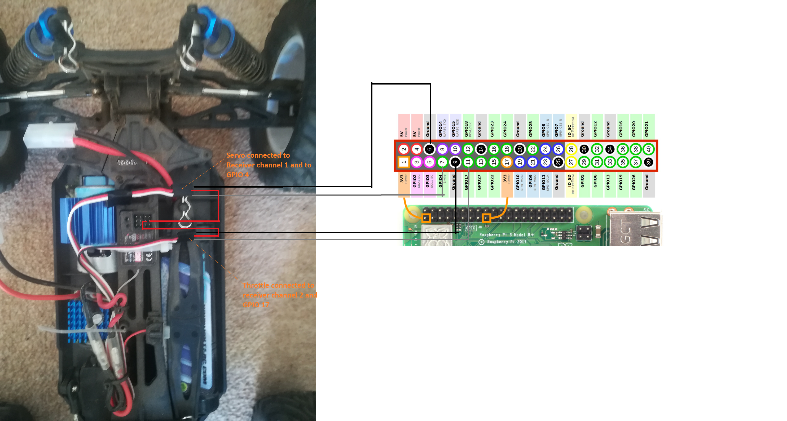

Some close-ups of the wire installation.

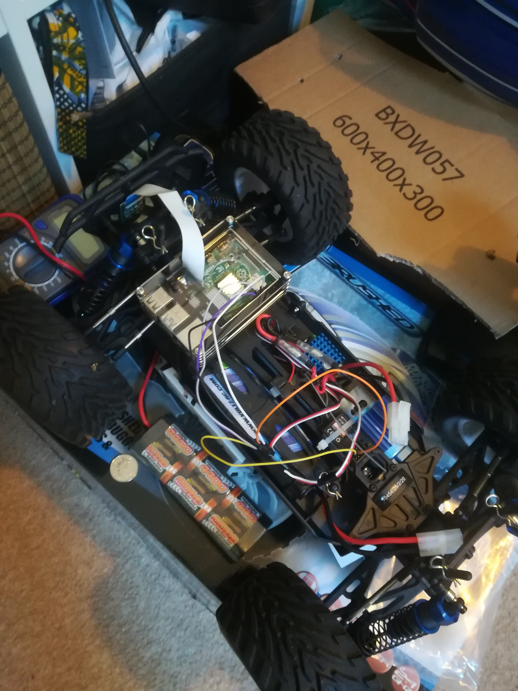
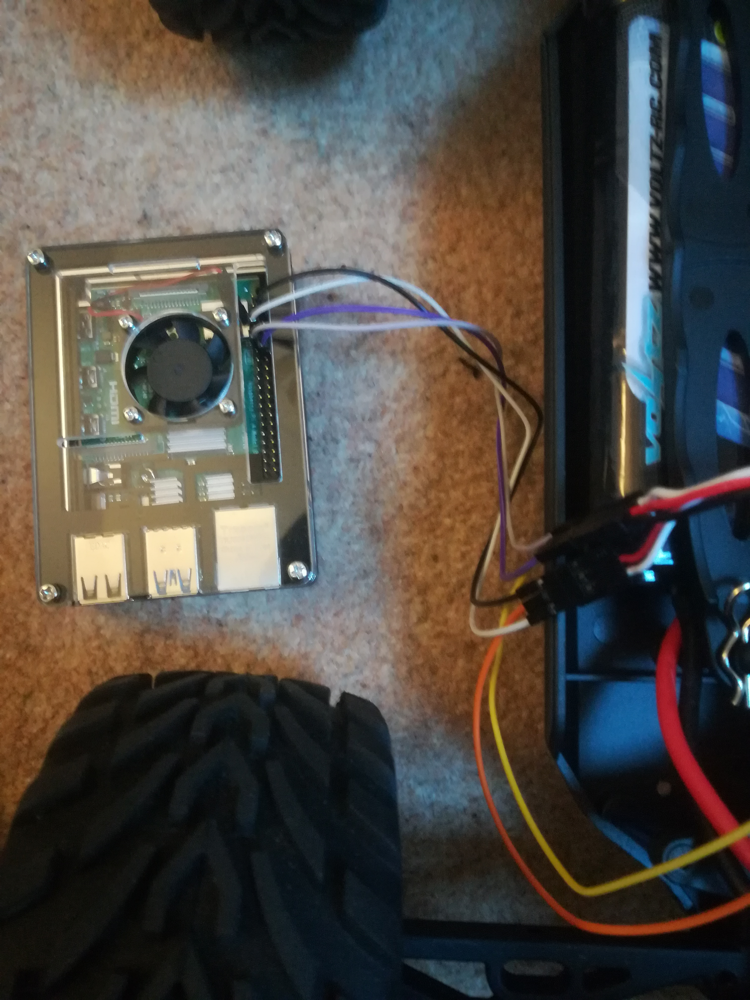
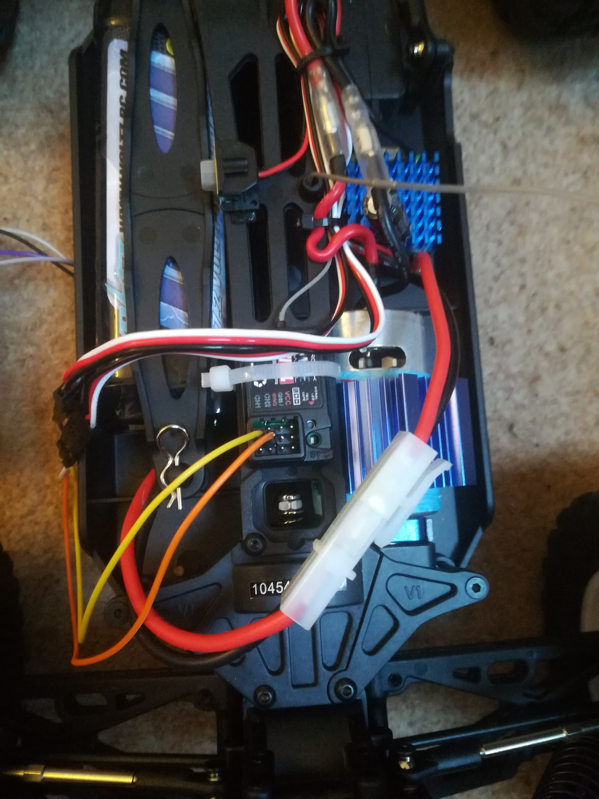

Note that the receiver feeds the servo hence the red cables go into the receiver.


## 3. Controls and software
This was a rather interesting phase of the project. I implemented two different ways of controlling the car to collect the images:
1. Blue dot app: the RC car can be controlled using an android app which connects with the Raspberry pi via Bluetooth. You are limited to what you can do with this application. In order to start the car, you tap the blue dot. Once the dot has turned green, the car should start (sometimes you need to increase the PWM value depending on the battery charge) and you can steer moving your finger around the dot. Double-tap the blue dot and it will turn red, stopping the car and copying all the pictures taken to an USB.


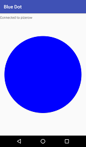


2. PS3 controller, a lot functionality. See picture below.
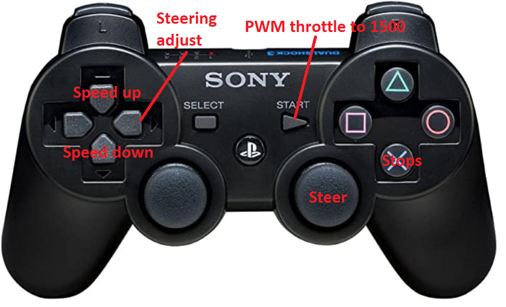

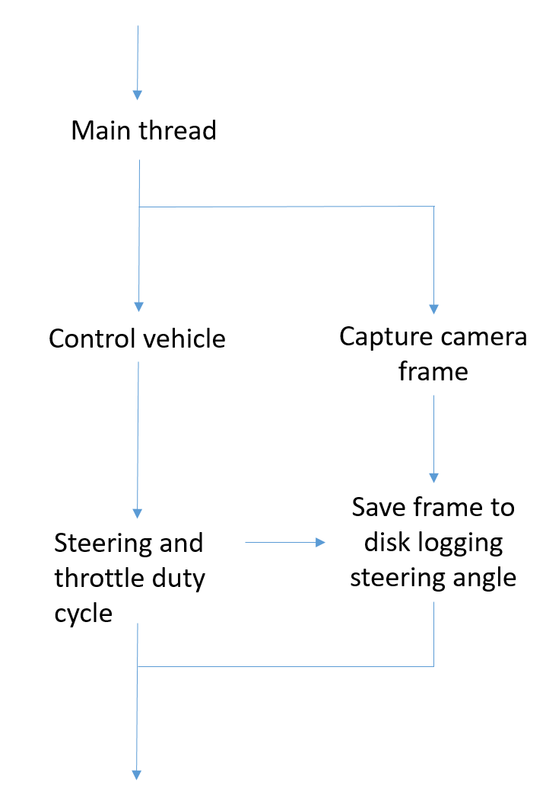


My approach to control the car steering command is very simple, it relies on the car driving a relatively flat surface. Imagine that the CNN outputs the following mask (10x10)

 
| 1 | 2 | 3 | 4 | 5 | 7 | 8 | 9 | 10 |
|---|---|---|---|---|---|---|---|----|
| 0 | 0 | 0 | 0 | 0 | 0 | 0 | 0 | 0  | 
| 0 | 0 | 0 | 0 | 0 | 0 | 0 | 0 | 0  | 
| 0 | 0 | 0 | 0 | 0 | 0 | 0 | 0 | 0  |
| 0 | 0 | 0 | 0 | 0 | 0 | 0 | 0 | 0  |
| 0 | 0 | 0 | 1 | 0 | 0 | 0 | 0 | 0  |
| 0 | 1 | 1 | 1 | 0 | 0 | 0 | 0 | 0  |
| 0 | 1 | 1 | 1 | 0 | 0 | 0 | 0 | 0  |
| 0 | 1 | 1 | 1 | 1 | 0 | 0 | 0 | 0  |
| 0 | 1 | 1 | 1 | 1 | 1 | 0 | 0 | 0  |
| 1 | 1 | 1 | 1 | 1 | 1 | 1 | 0 | 0  |

where 0 is the background (sky, grass, trees) and 1 is the path.
Since the mask is 10 x 10, the centre line or vehicle reference is column 5, right in the middle. However the CNN is showing there is more path in line 4, summing all the columns you will notice
that column 4 sums 6 while columns 2 and 3 sum 2 hence the vehicle will steer to the left from column 5 to 4. How much exactly? Oh well...That comes down to your PD controller. 

Another situation would be the following, the car is deviating from the centreline for whatever reason, then the output mask looks like:

| 1 | 2 | 3 | 4 | 5 | 7 | 8 | 9 | 10 |
|---|---|---|---|---|---|---|---|----|
| 0 | 0 | 0 | 0 | 0 | 0 | 0 | 0 | 0  | 
| 0 | 0 | 0 | 0 | 0 | 0 | 0 | 0 | 0  | 
| 0 | 0 | 0 | 0 | 0 | 0 | 0 | 0 | 0  |
| 1 | 0 | 0 | 0 | 0 | 0 | 0 | 0 | 0  |
| 1 | 0 | 0 | 0 | 0 | 0 | 0 | 0 | 0  |
| 1 | 1 | 1 | 0 | 0 | 0 | 0 | 0 | 0  |
| 1 | 1 | 1 | 1 | 0 | 0 | 0 | 0 | 0  |
| 1 | 1 | 1 | 1 | 1 | 0 | 0 | 0 | 0  |
| 1 | 1 | 1 | 1 | 1 | 1 | 0 | 0 | 0  |
| 1 | 1 | 1 | 1 | 1 | 1 | 1 | 0 | 0  |


Now if you sum the values of each column, you will see column 1 has the greatest value. Since column 5 (the middle column) is our reference and the column 1 has the highest sum then the car needs to
steer to the left more aggresively than in the scenerio explained before. 

Hopefully the following gif makes my approach a bit clearer:


Apart from a PD control (see below), the car needs a filter to smooth the commnad input to the servo as the inference is not fast enough, only around 7 predicted mask per second (see next section).

Steering command = K * (Column reference - Column with highest summed value) + D* d(Column reference - Column with highest summed value)/dt

Note that in reality the prediction mask has better resolution, 224x224 insteaad of 10x10. The column reference in this case is 112.


# Software
Software was developed in different environments (Ubuntu, Windows 10 and Raspbian). Prototyping was done in Python. All the embedded code for the car is C++. 
Keras with Tensorflow backend to explore differents network architectures. OpenCV (C++ and Python) and Pillow for dealing with images/video. 

For Python:

| Package/Software        | version |
|-------------------------|---------|
| Python                  | 3.7     |
| Keras                   | 2.3.1   |
| Tensorflow              | 2.1     |
| numpy                   | 1.18.4  |
| OpenCV (built natively) | 4.3.0   |
| Pillow                  | 7.1.2   |
| imageio                 | 2.5.0   |
| imgaug                  | 0.2.9   |
| imgviz                  | 1.1.0   |
| scikit-learn            | 0.23.0  |
| bluedot                 | 1.3.2   |
| pigpio                  | 1.46    |

**IDEs**
For Windows:
Microsoft Visual Studio Express 2017 (Version 15.9.21)
PyCharm 2019.2.3

For Linux:
Code::Blocks 17.12 (C++)
Thonny 3.2.6 (Python)


## 4. Collecting data and labelling
All pictures and videos were taken different times of the day with different light conditions at University Parks in Oxford.


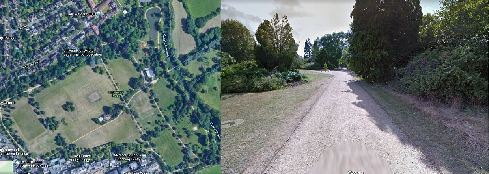


The raw pictures were taken at 1024x768. Due to limitations with SD writing speeds, only 11 pictures are taken per second.
The camera was placed in different places, mostly looking forward at different heights.
Labelme (https://github.com/wkentaro/labelme/blob/master/README.md) was used to label around 200 pictures manually.

## 5. Training models
Two different approaches:
1. Dave-2 end-to-end driving. Everytime a picture was taken, the steering angle applied was logged. Then images (+ augmentation) was fed into the network along with the steering angles. The network then replicates the driving.
Although impressive there is nothing innovative here, imitation learning has been done by many people See architecture below, it contains 250 thousand parameters. I also tested quantization.


2. Using semantic segmentation to detect the road/path and then steer the car accordingly, trying to keep the centerline of the vehicle aligned with the horizon.


The raw pictures were resized to match the netwowrk and augmented randomly with cropping, rotation and gaussian filters.


Several different models were tested for the segmentation approach (see below). Although there are plenty to explore (ie: https://awesomeopensource.com/project/mrgloom/awesome-semantic-segmentation), I ended up tweaking existing architectures to adjust the number of paramenters to bring down latency. 
1. Vainilla Segmentation as specified in https://divamgupta.com/image-segmentation/2019/06/06/deep-learning-semantic-segmentation-keras.html. Only 400K parameters. Very simple and decent enough results but struggling a lot with some shadows, sky, rocks and sunshine. I added an extra layer in the encoder and decoder so now the number of filters go up to 256 with much better results (1.96 million parameters).


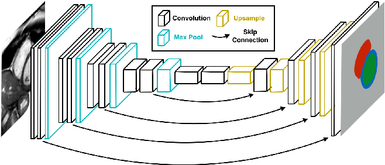


2. Unet: typical example of segmentation in medicine to detect cancer but too many parameters. A modified version of C-UNET++ was implemented (https://hal.inria.fr/hal-02277061/file/Bahl_iccvw_2019.pdf). It has 800k parameters.


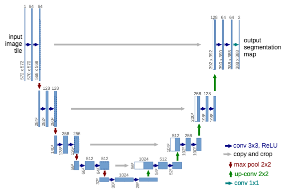


3. HairMatteNet (https://arxiv.org/pdf/1712.07168.pdf): As the name indicates, originally used to detect hairline. Lightweight segmentation based on MobileNet with a custom decoder (some skip connections and simplified reverse MobileNet). Best results so far, it contains around 3.8 million parameters but it doesn't mistake benches, sky and sun reflections as the park path. Only 3.8 million


Once the model is trained in a laptop then it's saved in tensorflow lite format. The tensorflow code is then tested in c++ to evaluate its performance.
See computational performance based on the average time reading 20 different pictures. For some reason the performance of the simple segmentation is very poor.


| Architecture            | latency | # of params |
|-------------------------|---------|-------------|
| Simple segmentation     | 1367ms  |    1.96M    |
| C-Unet++                | 167ms   |    0.8M     |
| HairMatteNet            | 371ms   |    3.8M     |


Best result achieved with HairMatteNet but it makes real-time controls very difficult. 
**C-Unet++** had good enough performance from both computational and computer vision point of view.


Below there are some examples of challenging segmentation with dry patches on the grass, shoes/legs, shadows and reflections. 
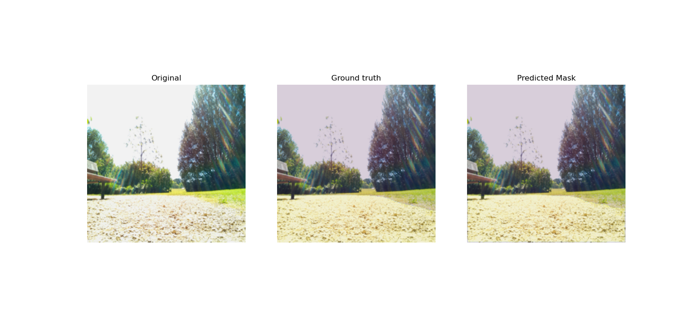
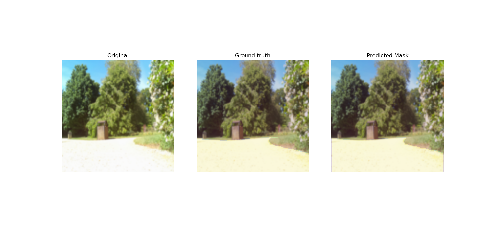
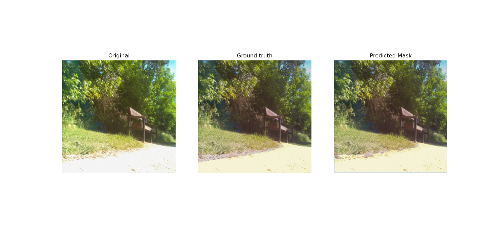
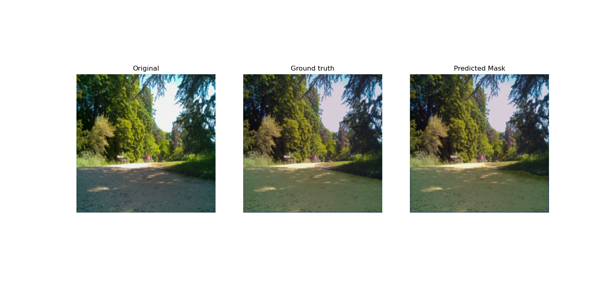
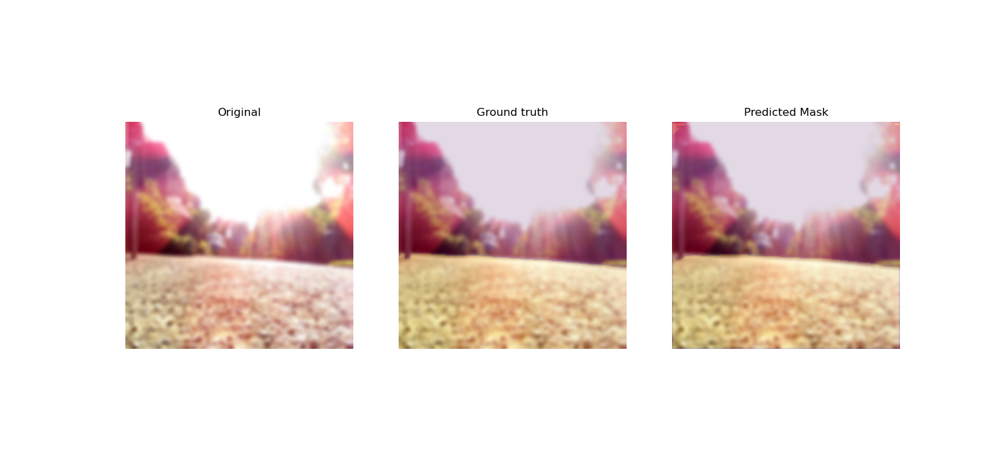
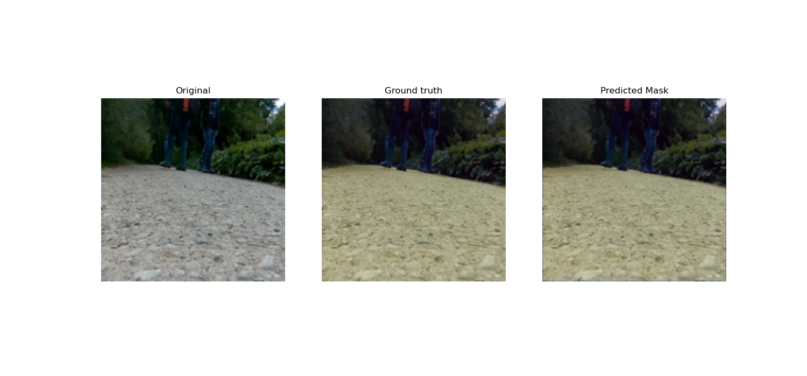


## 6. Embedded software

All the useful embeded software is in folder '''ARC02_inference'''.


## Final Results
A bit jerky at times when segmentation is not perfect. PD controller needs to be fine-tuned.


Lessons learned:
- Got a clearer picture of motors and how they are controlled. For this project, it has been mostly through a ESC (Electronic Speed Controller driven by PWM, sue me I don't have a real-time machine, or the budget for it) but also created my own circuit on a breadbord with a L293D. 
- How computationally limited a RPi is, as of today, an NVidia Jetson sounds like the only plausible option beyond a simple end-to-end driving with a CNN.There is also limitations due to camera bandwitdth and memory.
- Overcoming the (computational) limitations of RPI has proved to be a challenge. Now I have a better understanding of multithreadidng (race conditions, inter-locking) in both environments, Python and C++(OpenMP, good resource: https://csinparallel.org/csinparallel/ppps/openmp.html ).
- Project management, how quickly (and easily) the budget can escalate. I've suffered myself planning fallacy as described in "Thinking, fast and slow" by Daniel Kahneman. The bottom line is Don't let optimism bias take over, based estimations on data. In this case the timeframe was half a year, it took over a year. Regarding the cost, the inital budget was around 300 pounds. It just went over 500.
- Coding: definitely helped to improve my coding skills, I do have a better knowledge of python and how to optimise the code to handle large memory chunks. I'm a C++ guy tho. 
- I've gained some fluency on OpenCV to manipulate images/video and definitely I'm getting better with Keras although I think everyone taking ML seriously should know how to write a neural network framework (to implement custom layers at least)... but that can be found in a different repository.
- Semantic segementation and implementation of more complex architectures. Experimenting with the different layers and parameters of CNNs.


Notes:
- The code has been developed in different platforms, mostly Ubuntu, Raspbian and Windows 10. Apologies if folders don't work well.
- Grass dried in summer and made it difficult for the neural network to recognise the path correctly so the driving was a bit more jerky.
- The tutorials in qengineering.eu are very useful (ie: https://qengineering.eu/install-tensorflow-2-lite-on-raspberry-pi-4.html, although I figuered out how to soft link flatbuffers by myself)
- Raspberry pi 4 can run up to 4 times slower when hot. It gets very hot when there is a USB connected.
- Tempted to overclock the raspberry pi but I'm using a powerbank for mobiles to supply the 5V needed.
- I'm buying a Lidar. This project has been good fun.


PS3 controller instructions (for Raspberry pi 4):
1. Download sixpair.c from http://pabr.org/sixlinux/sixlinux.en.html
2. Compile it gcc -o sixpair sixpair.c -lusb
3. Connect PS3 to RPi via USB and run ```./sixpair```
4. Write down the bd_addr
5. ```sudo bluetoothctl``` ```agent on``` ```scan on```
6. Press PS button
7. ```connect bd_addr```
8. ```trust bd_addr```

Open MP for Linux:
1. Check your compiler version ```gcc --version```. Anything above 4.2 is compatible I believe.
2. Add the flag ```-fopenmp``` and link to gomp library when compiling

